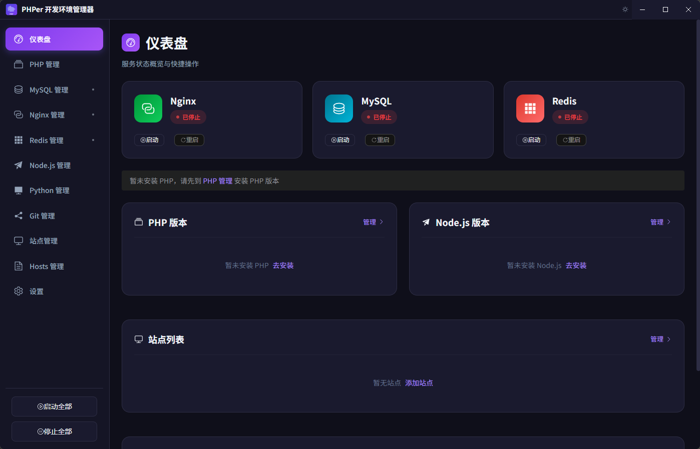
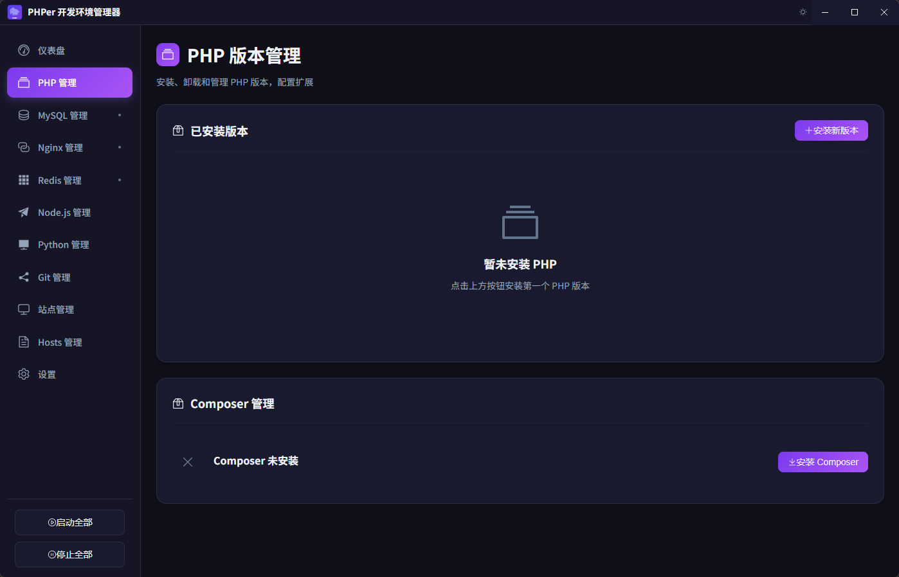
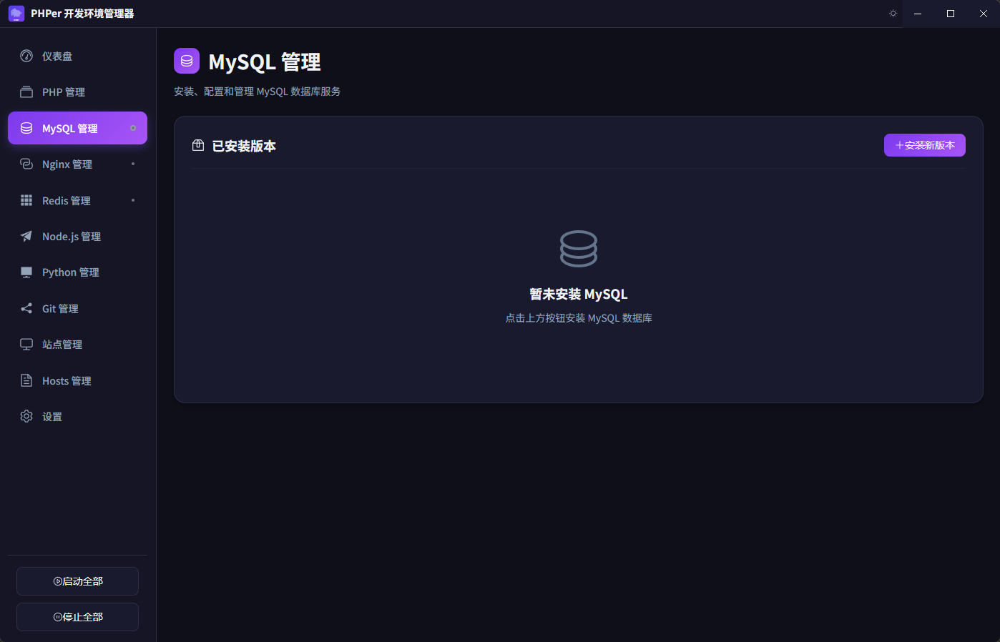
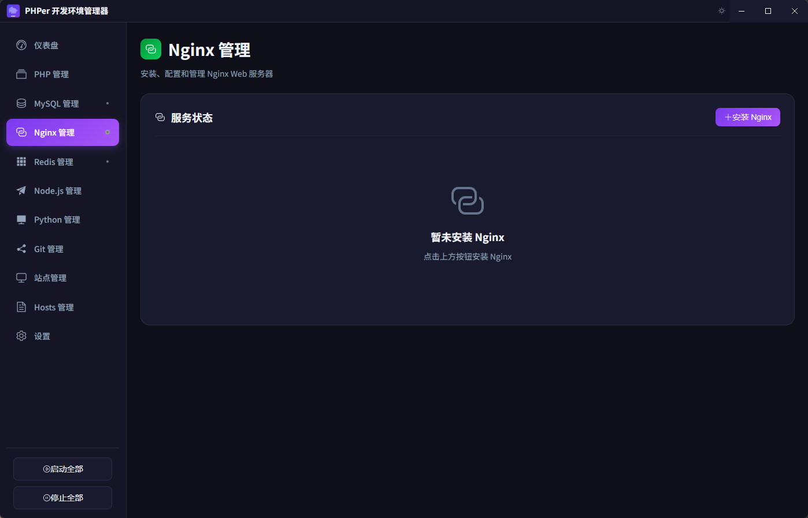
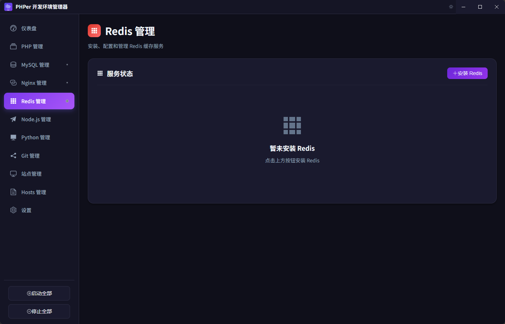
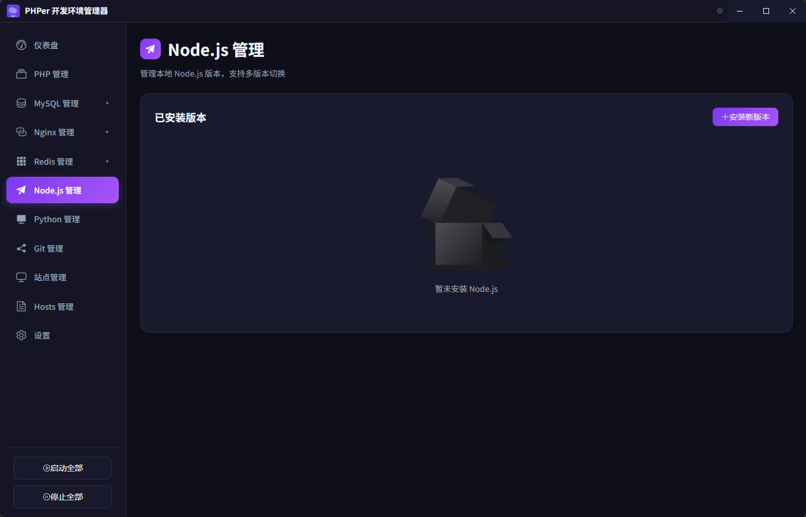
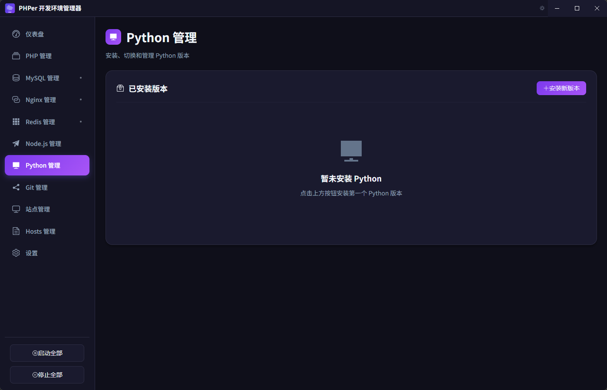
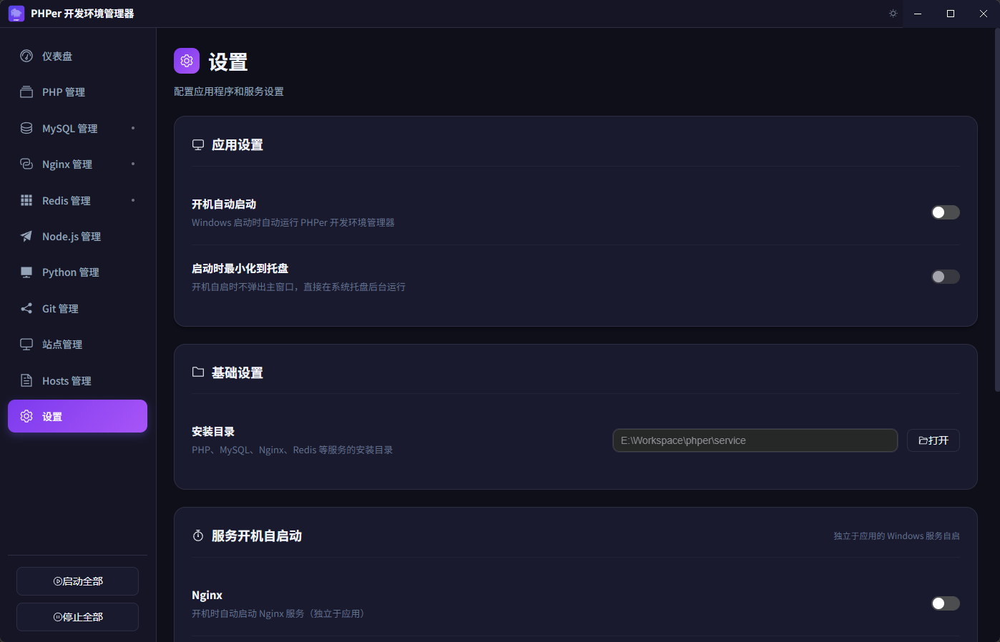

# PHPer 开发环境管理器

<p align="center">
  
</p>

<p align="center">
  <strong>一款功能强大的 Windows PHP 开发环境管理工具</strong>
</p>

<p align="center">
  轻松管理 PHP、MySQL、Nginx、Redis、Node.js、Python 等服务，告别繁琐的手动配置
</p>

<p align="center">
  <a href="#功能特性">功能特性</a> •
  <a href="#安装使用">安装使用</a> •
  <a href="#使用指南">使用指南</a> •
  <a href="#常见问题">常见问题</a>
</p>

---

## 📸 界面预览

<table>
  <tr>
    <td></td>
    <td></td>
  </tr>
  <tr>
    <td align="center">🏠 仪表盘</td>
    <td align="center">🐘 PHP 版本管理</td>
  </tr>
  <tr>
    <td></td>
    <td></td>
  </tr>
  <tr>
    <td align="center">🐬 MySQL 管理</td>
    <td align="center">🌐 Nginx 管理</td>
  </tr>
  <tr>
    <td></td>
    <td></td>
  </tr>
  <tr>
    <td align="center">🔴 Redis 管理</td>
    <td align="center">💚 Node.js 管理</td>
  </tr>
  <tr>
    <td></td>
    <td></td>
  </tr>
  <tr>
    <td align="center">🐍 Python 管理</td>
    <td align="center">⚙️ 设置</td>
  </tr>
</table>

## ✨ 功能特性

### 🐘 PHP 版本管理

| 功能         | 说明                                                       |
| ------------ | ---------------------------------------------------------- |
| 多版本管理   | 支持同时安装 PHP 8.1、8.2、8.3、8.4、8.5 等多个版本        |
| CGI 独立控制 | 每个 PHP 版本可独立启动/停止 CGI 进程，支持多版本并行运行  |
| 端口自动分配 | 各版本自动分配端口（如 8.4→9084, 8.3→9083）                |
| 一键切换     | 点击即可切换 PHP 版本，自动配置系统环境变量                |
| 扩展管理     | 可视化管理 PHP 扩展，支持在线安装（从 PECL）               |
| 配置编辑     | 在线编辑 php.ini，无需手动查找配置文件                     |
| 自动配置     | 安装时自动启用常用扩展（curl、gd、mbstring、pdo_mysql 等） |
| Composer     | 集成 Composer 管理，支持镜像源切换（阿里云、腾讯云等）     |
| 日志查看     | 直接查看 PHP 错误日志                                      |
| 下载源       | 从 [windows.php.net](https://windows.php.net) 官方下载     |

### 🐬 MySQL 管理

| 功能       | 说明                                                                 |
| ---------- | -------------------------------------------------------------------- |
| 版本支持   | 支持 MySQL 5.7.x 和 8.0.x 系列                                       |
| 服务控制   | 启动、停止、重启 MySQL 服务                                          |
| 密码管理   | 一键修改 root 密码                                                   |
| 配置编辑   | 在线编辑 my.ini 配置文件                                             |
| 自动初始化 | 安装时自动初始化数据库，开箱即用                                     |
| 下载源     | 从[阿里云镜像站](https://mirrors.aliyun.com/mysql/)下载，速度更快    |

### 🌐 Nginx 管理

| 功能         | 说明                                          |
| ------------ | --------------------------------------------- |
| 版本管理     | 支持多个 Nginx 版本，可随时切换               |
| 服务控制     | 启动、停止、重启、热重载配置                  |
| 站点管理     | 可视化添加、删除、启用、禁用虚拟主机          |
| Laravel 支持 | 自动生成 Laravel 项目的伪静态配置             |
| SSL 证书     | 支持申请 Let's Encrypt 免费 SSL 证书          |
| 配置编辑     | 在线编辑 nginx.conf 主配置文件                |
| 下载源       | 从 [nginx.org](https://nginx.org) 官方下载    |

### 🔴 Redis 管理

| 功能         | 说明                                                                       |
| ------------ | -------------------------------------------------------------------------- |
| Windows 版本 | 使用 Windows 原生编译版 Redis                                              |
| 服务控制     | 启动、停止、重启 Redis 服务                                                |
| 状态监控     | 实时查看运行状态、内存使用情况                                             |
| 配置编辑     | 在线编辑 redis.windows.conf 配置                                           |
| 下载源       | 从 [GitHub (redis-windows)](https://github.com/redis-windows/redis-windows) 下载 |

### 💚 Node.js 管理

| 功能       | 说明                                                     |
| ---------- | -------------------------------------------------------- |
| 多版本管理 | 支持同时安装多个 Node.js 版本                            |
| LTS 支持   | 显示 LTS 版本和 Current 版本标识                         |
| npm 集成   | 自动显示对应的 npm 版本                                  |
| 一键切换   | 快速切换默认 Node.js 版本，自动配置环境变量              |
| 下载源     | 从 [nodejs.org](https://nodejs.org) 官方下载             |

### 🐍 Python 管理

| 功能       | 说明                                                     |
| ---------- | -------------------------------------------------------- |
| 嵌入式版本 | 使用免安装的嵌入式版本，不影响系统环境                   |
| pip 集成   | 自动配置 pip，支持安装 Python 包                         |
| 多版本管理 | 支持同时安装多个 Python 版本                             |
| 一键切换   | 快速切换默认 Python 版本                                 |
| 下载源     | 从 [python.org](https://www.python.org) 官方下载         |

### 🔧 Git 管理

| 功能       | 说明                           |
| ---------- | ------------------------------ |
| 版本管理   | 一键安装/卸载 Git for Windows  |
| 配置管理   | 可视化配置用户名、邮箱等信息   |
| 环境变量   | 自动配置系统 PATH              |

### 🌍 站点管理

- ➕ **快速创建站点** - 填写域名和路径即可创建虚拟主机
- 🎯 **Laravel 一键配置** - 自动配置 public 目录和伪静态规则
- 🔒 **SSL 证书申请** - 集成 Let's Encrypt 自动申请
- 📝 **Hosts 自动配置** - 自动添加域名到系统 hosts 文件
- 📋 **站点日志查看** - 查看每个站点的访问日志和错误日志
- 🌐 **一键打开站点** - 点击域名在默认浏览器打开

### 📋 日志查看

| 功能         | 说明                                           |
| ------------ | ---------------------------------------------- |
| 多服务日志   | 支持查看 Nginx、PHP、MySQL、Redis 日志         |
| 站点日志     | 查看各站点的访问日志和错误日志                 |
| 实时刷新     | 支持刷新日志内容，查看最新记录                 |
| 行数控制     | 可配置显示的日志行数（100-5000 行）            |
| 快速清空     | 一键清空指定日志文件                           |
| 打开目录     | 快速在文件管理器中打开日志目录                 |

### ⚙️ 其他功能

- 🚀 **开机自启动** - 可配置各服务开机自动启动（静默模式，无弹窗）
- 🔇 **静默启动** - 所有服务启动无黑色窗口闪烁
- 📋 **Hosts 管理** - 可视化管理系统 hosts 文件
- 🌙 **深色/浅色主题** - 支持主题切换
- 📊 **服务状态监控** - 实时显示各服务运行状态
- ⚡ **页面切换优化** - 使用 KeepAlive 缓存页面，切换无闪烁
- 🔢 **自动版本号** - 打包时自动更新版本号
- 📥 **下载源说明** - 清晰显示各软件的下载来源
- 🌐 **默认浏览器打开** - 站点链接自动在默认浏览器打开

## 🛠️ 技术栈

| 技术                                          | 说明         |
| --------------------------------------------- | ------------ |
| [Vue 3](https://vuejs.org/)                   | 前端框架     |
| [TypeScript](https://www.typescriptlang.org/) | 类型安全     |
| [Electron](https://www.electronjs.org/)       | 桌面应用框架 |
| [Element Plus](https://element-plus.org/)     | UI 组件库    |
| [Vite](https://vitejs.dev/)                   | 构建工具     |
| [Pinia](https://pinia.vuejs.org/)             | 状态管理     |

## 📦 安装使用

### 系统要求

- ✅ Windows 10/11 (64 位)
- ✅ Node.js 18.0 或更高版本
- ✅ 管理员权限（用于管理服务和修改 hosts 文件）
- ✅ [Visual C++ Redistributable 2015-2022](https://aka.ms/vs/17/release/vc_redist.x64.exe)

### 开发环境

```bash
# 克隆项目
git clone https://github.com/your-username/phper.git
cd phper

# 安装依赖
npm install

# 启动开发服务器
npm run electron:dev
```

### 构建生产版本

```bash
# 构建 Windows 安装包（自动更新 patch 版本号 +0.0.1）
npm run build

# 指定版本号更新类型
npm run build:patch   # 1.0.0 -> 1.0.1
npm run build:minor   # 1.0.0 -> 1.1.0
npm run build:major   # 1.0.0 -> 2.0.0

# 不更新版本号直接打包
npm run build:nobump
```

构建完成后，安装包将生成在 `release` 目录中。

## 📁 项目结构

```
phper/
├── electron/                    # Electron 主进程
│   ├── main.ts                 # 主进程入口
│   ├── preload.ts              # 预加载脚本（IPC 通信）
│   └── services/               # 服务管理模块
│       ├── ConfigStore.ts      # 配置存储（使用 electron-store）
│       ├── PhpManager.ts       # PHP 版本管理器
│       ├── MysqlManager.ts     # MySQL 服务管理器
│       ├── NginxManager.ts     # Nginx 服务管理器
│       ├── RedisManager.ts     # Redis 服务管理器
│       ├── NodeManager.ts      # Node.js 版本管理器
│       ├── PythonManager.ts    # Python 版本管理器
│       ├── GitManager.ts       # Git 管理器
│       ├── ServiceManager.ts   # 开机自启服务管理器
│       ├── HostsManager.ts     # Hosts 文件管理器
│       └── LogManager.ts       # 日志管理器
│
├── src/                         # Vue 前端源码
│   ├── App.vue                 # 根组件（含 KeepAlive 缓存）
│   ├── main.ts                 # 入口文件
│   ├── vite-env.d.ts           # 类型声明
│   ├── router/                 # 路由配置
│   │   └── index.ts
│   ├── stores/                 # Pinia 状态管理
│   │   └── serviceStore.ts     # 服务状态存储
│   ├── components/             # 公共组件
│   │   └── LogViewer.vue       # 日志查看器组件
│   ├── styles/                 # 样式文件
│   │   └── main.scss           # 全局样式（含主题变量）
│   └── views/                  # 页面视图
│       ├── Dashboard.vue       # 仪表盘
│       ├── PhpManager.vue      # PHP 管理
│       ├── MysqlManager.vue    # MySQL 管理
│       ├── NginxManager.vue    # Nginx 管理
│       ├── RedisManager.vue    # Redis 管理
│       ├── NodeManager.vue     # Node.js 管理
│       ├── PythonManager.vue   # Python 管理
│       ├── GitManager.vue      # Git 管理
│       ├── SitesManager.vue    # 站点管理
│       ├── HostsManager.vue    # Hosts 管理
│       └── Settings.vue        # 设置
│
├── scripts/                     # 构建脚本
│   └── bump-version.js         # 版本号自动更新脚本
│
├── public/                      # 静态资源
│   ├── icon.svg                # 应用图标
│   └── version.json            # 版本信息（构建时生成）
│
├── index.html                   # HTML 模板
├── package.json                 # 项目配置
├── vite.config.ts              # Vite 配置
├── tsconfig.json               # TypeScript 配置
└── README.md                   # 项目说明
```

## 📖 使用指南

### 首次使用

1. **安装运行时依赖**

   - 确保已安装 [Visual C++ Redistributable 2015-2022](https://aka.ms/vs/17/release/vc_redist.x64.exe)

2. **以管理员身份运行**

   - 右键点击应用图标，选择"以管理员身份运行"
   - 这是管理服务和修改 hosts 文件所必需的

3. **安装服务**
   - 首次使用需要安装 PHP、MySQL、Nginx、Redis
   - 进入对应管理页面，点击"安装"按钮

### 创建第一个站点

1. 安装并启动 Nginx 和 PHP
2. 进入"站点管理"页面
3. 点击"添加站点"
4. 填写站点信息：
   - 站点名称：如 `myproject`
   - 域名：如 `myproject.test`
   - 根目录：如 `C:\Projects\myproject`（Laravel 项目无需指定 public）
   - 选择 PHP 版本
   - 如果是 Laravel 项目，开启"Laravel 项目"选项
5. 点击确认，站点即创建完成
6. 在浏览器访问 http://myproject.test

### 配置开机自启动

1. 进入"设置"页面
2. 在"开机自启动"部分，开启需要自启的服务
3. 应用会在 Windows 启动目录创建启动脚本

## ❓ 常见问题

### Q: 为什么需要管理员权限？

A: 应用需要管理员权限来：

- 启动/停止 Windows 服务
- 修改系统 hosts 文件
- 配置系统环境变量

### Q: PHP 下载很慢怎么办？

A: PHP 从 windows.php.net 官方下载，如果速度较慢：

- 可以手动从官网下载 ZIP 文件
- 解压到 `[安装目录]/php/php-版本号` 目录
- 重新打开应用即可识别

### Q: MySQL 启动失败？

A: 常见原因：

- 3306 端口被占用，检查是否有其他 MySQL 实例
- 防火墙阻止，添加防火墙规则
- 数据目录权限问题，确保目录可写

### Q: 如何卸载服务？

A: 进入对应服务管理页面，先停止服务，然后点击"卸载"按钮。

## 🔗 相关资源

| 软件    | 下载源                                                                 |
| ------- | ---------------------------------------------------------------------- |
| PHP     | [windows.php.net](https://windows.php.net/download/) - 官方 Windows 版 |
| MySQL   | [阿里云镜像](https://mirrors.aliyun.com/mysql/) - 国内高速下载         |
| Nginx   | [nginx.org](https://nginx.org/en/download.html) - 官方 Windows 版      |
| Redis   | [GitHub redis-windows](https://github.com/redis-windows/redis-windows) |
| Node.js | [nodejs.org](https://nodejs.org/en/download/) - 官方下载               |
| Python  | [python.org](https://www.python.org/downloads/windows/) - 嵌入式版本   |
| Git     | [git-scm.com](https://git-scm.com/download/win) - 官方 Windows 版      |

## 📄 开源协议

本项目基于 [MIT License](LICENSE) 开源。

## 🤝 贡献指南

欢迎提交 Issue 和 Pull Request！

1. Fork 本仓库
2. 创建功能分支 (`git checkout -b feature/AmazingFeature`)
3. 提交更改 (`git commit -m 'Add some AmazingFeature'`)
4. 推送到分支 (`git push origin feature/AmazingFeature`)
5. 提交 Pull Request

## 📮 反馈建议

如果您在使用过程中遇到问题或有任何建议，欢迎：

- 提交 [Issue](https://github.com/your-username/phper/issues)
- 发送邮件至 your-email@example.com

---

<p align="center">
  Made with ❤️ for PHP Developers
</p>

<p align="center">
  ⭐ 如果这个项目对您有帮助，请给我们一个 Star！
</p>
